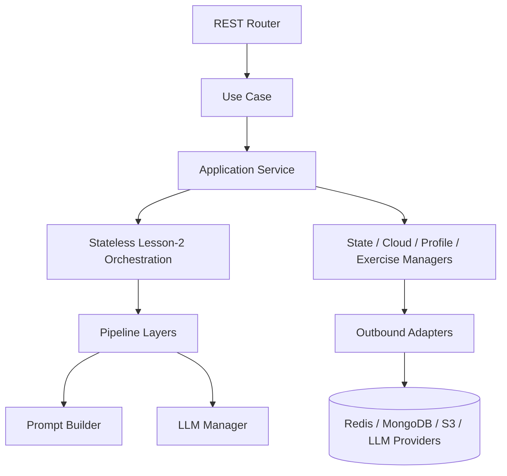

# AI-Service Specification: Overall Design

## 1. Pedagogical Philosophy

### 1.1 Curriculum Structure

The curriculum is organized across 3 levels:

```
Subject → Topic → Concept
```

Each **Concept** includes the following content types: `definition`, `formula`, `method`, `property`, `application`, `common_mistake`, `visualization`.

*Example:* `math → calculus → limits` would cover the definition of a limit, formulas for evaluating limits, real-world applications, and so on.

---

### 1.2 Learning Model: P-D-E-O

Students progress through a repeating loop:

```
Problem → Done → Execute → Optimize → (new Problem)
```

Core principle: **"Done > Perfect"** — completion matters more than perfection.  
This is reflected at the technical level: incorrect answers still advance the progress bar by a small amount.

---

### 1.3 Session Structure

Each Concept spans **2 sessions**:

| | Session 1 | Session 2 |
|---|---|---|
| **Goal** | Understand enough to solve basic multiple-choice questions | Master the concept through conversation and practice problems |
| **Format** | Self-study the content | Chat with the AI chatbot, solve 4 problems |
| **Output** | Build a foundation | Progress bar reaches 100% |

---

### 1.4 The 4-Problem Structure — Session 2

| # | Role | Description |
|---|---|---|
| P1 | REINFORCEMENT | Review knowledge from Session 1 |
| P2 | CHALLENGE | Harder, but same problem type |
| P3 | EXPLORATION | Difficult and non-standard — breaks old patterns |
| P4 | EXTENSION | Same difficulty as P3, builds confidence with the new pattern |

Students work through problems in a fixed order: P1 → P4. This is an intentional design decision: the P3 → P4 sequence only delivers its pedagogical effect when completed consecutively.

---

### 1.5 Chatbot Behavior — The "Study Buddy" Model

The chatbot does not act as a teacher; it acts as a **fellow student**:

- The chatbot **follows the student's approach**, never leads
- **Correct answer** → confirm → nudge the student to self-identify any weak points (if any)
- **Incorrect answer** → chatbot "shares its own perspective" to ask a question → student recognizes the mistake → repeat (up to 3 times)
- After 3 consecutive errors on the same mistake → switch to `SOFT_INTERVENTION`: the chatbot temporarily steps out of the study-buddy role, directly suggests the next step (without giving the answer), and offers the option to skip with a score penalty

Key technique: the chatbot **"voices doubt, not diagnosis"** — *"Hmm, I tried that approach and got stuck at the point where..."* rather than *"You forgot to handle case X."*

---

### 1.6 Progress Bar Mechanics

- Progress only increases when an answer is **submitted** (the chatbot saying right/wrong does not count)
- Correct answer → larger progress gain; incorrect answer → smaller gain (both are > 0)
- Goal: reach 100% by the end of Session 2
- Anti-farming protection: if random guessing is detected, progress gains are temporarily paused

---

## 2. Core Engine — Technical Architecture

## 1. Overview

This application is a FastAPI-based AI tutoring service organized around a clean application/domain/adapters split. The core responsibilities are:

- handling student chat turns for Lesson 2,
- extracting exercises from uploaded documents,
- selecting exercises based on a student profile,
- compressing and closing sessions when they expire,
- persisting session and profile state,
- routing all LLM interaction through a single manager and prompt builder.

The lesson-2 chat flow is the main pipeline. It is built from deterministic orchestration plus LLM-backed layers that observe, decide, and respond.

## 2. Runtime Entry Points

The FastAPI app is created in the REST `main.py` entrypoint. It wires the dependency container, mounts observability middleware, exposes Prometheus metrics, and registers two routers:

- `/chat` for live lesson-2 tutoring
- `/exercise` for extraction and exercise selection

There is also a `/health` endpoint for service checks.

## 3. High-Level Architecture



The application layer owns behavior. Adapters implement transport and storage. Domain models define the message, session, exercise, and response contracts.

## 4. Chat Pipeline

### 4.1 Request Flow

The `/chat` endpoint calls `ChatbotUseCase.run(...)` with:

- user identity and correlation id,
- session id,
- lesson subject/topic/concept,
- the current user message,
- submission metadata,
- background tasks for deferred cleanup.

The use case performs session validation, session-history management, orchestration, and persistence of the turn.

### 4.2 ChatbotUseCase Responsibilities

`ChatbotUseCase` is the application-level coordinator for a single chat turn.

Its responsibilities are:

- load all prior messages and session metadata from Redis,
- validate that the session belongs to the requesting user,
- close expired sessions asynchronously,
- compress history once the turn threshold is exceeded,
- delegate response generation to `Lesson2Orchestration`,
- persist the updated metadata and the new user/assistant turn back to Redis,
- return the generated content, token usage, and current progress.

Important behavior:

- expired sessions do not fail the request; they trigger background syncing and return a closure message,
- history compression keeps recent turns in Redis and moves older context into a summary,
- the use case is intentionally thin on business logic beyond session lifecycle control.

## 5. Lesson-2 Orchestration

`Lesson2Orchestration` is the central router for lesson-2 turns. It decides whether the request goes to:

- safety diversion,
- fast-path non-learning response,
- full learning pipeline,
- direct grounding for submissions.

The orchestration layer is where branching lives. The prompts themselves do not decide the path.

### 5.1 Routing Rules

- Submission turns skip classification and go directly to grounding.
- Non-submission turns are classified first.
- Safety outputs take precedence over learning responses.
- Fast-path replies are used for lightweight non-learning intents.
- Everything else proceeds through the full learning pipeline.

### 5.2 Grounding for Submissions

For submission turns, orchestration builds a `GroundInput` from:

- the current problem,
- the student’s running reasoning stored in session metadata,
- the submitted answer,
- the submission correctness flag.

It then calls the ground layer to judge the approach and returns the verdict for later decision-making.

### 5.3 Classification for Non-Submissions

For normal chat turns, orchestration builds a `ClassifyInput` from:

- the current user message,
- recent message history,
- current problem context,
- submission flags when present.

The classify layer returns intent, emotional signals, abuse flags, and routing hints.

## 6. Lesson-2 Full Pipeline

`FullPipeline` executes the learning path in four deterministic stages:

1. `Evaluate`
2. `Decide`
3. `Respond`
4. `StateWriter`

This pipeline is the core learning loop.

### 6.1 Evaluate

The evaluate layer observes the turn and returns a structured perception of the student state:

- phase,
- solution proximity,
- whether the student is stuck,
- current approach metadata,
- compressed reasoning,
- misconceptions,
- affective state,
- summary text.

The evaluate input is built from session metadata, recent history, and optional ground verdicts for submissions. Non-submission turns can run with no ground output.

### 6.2 Decide

The decide layer is deterministic and does not call the LLM. It converts upstream signals into a `ResponseDirective`.

Inputs include:

- classify output,
- ground output,
- evaluate output,
- submission status,
- current phase,
- attempt counts,
- abuse flags,
- current progress.

Its output selects:

- the response class,
- tone,
- depth,
- whether the problem should advance,
- whether intervention is required.

Decision priorities are:

- safety and abuse handling first,
- submission verdict handling second,
- non-submission learning behavior last.

### 6.3 Respond

The response layer turns the directive and context into student-facing text.

Prompt selection is deterministic:

- safety, refusal, meta, and empathy use the non-learning prompt,
- wrap-up uses the wrap-up prompt,
- learning turns use one of the phase prompts for Problem, Execute, Optimize, or Done.

The response layer passes recent messages to the LLM and returns the final natural-language output.

### 6.4 State Writer

The state writer is the only layer that mutates `SessionMetadata`.

It updates:

- last evaluation summary,
- misconception history,
- phase history,
- active approach state,
- submission history,
- attempt counters,
- per-problem progress,
- current problem advancement when the directive allows it.

This keeps session state as the single source of truth for future turns.

## 7. Fast-Path and Safety Paths

### 7.1 FastPathReply

`FastPathReply` handles lightweight non-learning interactions such as greetings, meta questions, emotional expressions, and answer-extraction attempts.

It:

- maps the classified intent to a response class,
- builds a simplified response directive,
- calls the response layer directly,
- writes state through the state writer layer,
- bypasses evaluate and decide.

### 7.2 SafetyDivert

`SafetyDivert` is used when the classifier indicates a safety risk.

It:

- builds a safety-handoff response directive,
- calls the response layer,
- writes state through the state writer layer,
- returns an empathetic, intervention-oriented reply.

## 8. Supporting Services

### 8.1 SessionManager

`SessionManager` is the application service for session lifecycle and persistence.

It wraps Redis and Mongo-backed session stores and provides:

- metadata reads and writes,
- message history reads,
- turn writes,
- left/right history access for compression,
- whole-session deletion,
- archival of message history to MongoDB.

It is used by chat handling, compression, and session closure.

### 8.2 LearningService

`LearningService` supports history compression and session closure.

It has two main workflows:

- `compress_session_history(...)`
- `sync_and_close_session(...)`

Compression workflow:

- summarize older Redis history with the LLM,
- store the compressed text in session metadata,
- archive raw messages to MongoDB,
- delete the compressed messages from Redis.

Close-session workflow:

- archive remaining history to MongoDB,
- generate a session summary with the LLM,
- update the student profile through adaptive learning,
- mark the session inactive,
- persist metadata and clear Redis session state.

### 8.3 ProfileManager

`ProfileManager` is the profile persistence wrapper.

It loads and updates student profile data in MongoDB, and is used during session closure and exercise selection.

### 8.4 CloudManager

`CloudManager` wraps the cloud storage port.

It downloads lesson documents, uploads extracted assets, and deletes documents when needed.

### 8.5 ExerciseManager

`ExerciseManager` stores and retrieves exercises from the exercise store.

It is used by the exercise-selection path.

### 8.6 LLMManager

`LLMManager` is the single application service used for all LLM calls.

It delegates to the outbound LLM port and normalizes provider errors into application exceptions.

## 9. Prompt System

`PromptBuilder` loads prompt templates from `application/docs` and renders them with model data.

It supports:

- legacy prompt templates,
- lesson-2 classify, ground, evaluate, decide, response, wrap-up, compress, summarize, and non-learning prompts,
- dotted placeholder resolution such as nested fields inside structured inputs,
- enum and model serialization for prompt-safe rendering.

The prompt builder is shared by classify, evaluate, ground, response, compression, and summarization flows.

## 10. Exercise Extraction Flow

The `/exercise/extract/lesson2` endpoint calls `ExerciseExtractionUseCase.run(...)`.

Flow:

1. Download the document from cloud storage.
2. If it is already Markdown, use it directly.
3. If it is a PDF, convert it to Markdown and extract embedded images.
4. Upload extracted images back to cloud storage and rewrite local image references with public URLs.
5. Render the lesson-2 exercise-extraction prompt.
6. Ask the LLM for structured exercise output.
7. Attach the user id and return the formatted exercise response.

This use case is intentionally document-format aware and keeps PDF-to-Markdown transformation behind a dedicated service.

## 11. Exercise Selection Flow

The `/exercise/select/lesson2` endpoint combines three services:

- `ProfileManager` for the student profile,
- `ExerciseManager` for the stored exercise,
- `AdaptiveLearningService` for scoring and selection.

The adaptive-learning service ranks problems by role and student fit, then returns a lesson-2 exercise set in the order:

`REINFORCEMENT -> CHALLENGE -> EXPLORATION -> EXTENSION`

This lets the product serve a balanced set of problems aligned to the student profile.

## 12. Adaptive Learning

`AdaptiveLearningService` provides two related capabilities:

- problem selection,
- student-profile updates.

### 12.1 Problem Selection

The service scores each problem using a combination of:

- Bloom-level alignment,
- problem role target difficulty,
- approach count,
- open-approach fit,
- learning-style overlap,
- difficulty preference.

It selects one best problem per role from the available exercise set.

### 12.2 Student Profile Update

When a session closes, the service merges new learning signals into the existing profile instead of replacing it.

It deep-merges:

- strengths and weaknesses,
- learning style,
- difficulty preference,
- knowledge-map entries,
- mastery and struggle indicators.

It also produces a compact profile summary suitable for future prompts.

## 13. Data and State Model

Session metadata is the operational state for a lesson-2 session. It stores:

- the active lesson context,
- problem list and active problem id,
- per-problem state,
- phase history,
- misconceptions,
- compressed history,
- progress,
- session activity flags.

The code treats metadata as the source of truth for the current turn. Layer outputs are derived from it and written back into it by the state writer.

## 14. Error Handling

The application layer consistently translates lower-level exceptions into use-case or service exceptions.

General pattern:

- outbound adapter errors become manager errors,
- manager errors become use-case or pipeline errors,
- the REST layer converts those into HTTP 4xx/5xx responses.

This keeps error boundaries clear and prevents transport code from depending on infrastructure details.

## 15. Observability

The service includes:

- structured logging,
- metrics middleware,
- a Prometheus `/metrics` endpoint,
- correlation-id propagation through the REST layer.

The lesson-2 pipeline logs key lifecycle points at each major step, which makes turn-level tracing practical during debugging and operations.

## 16. Summary

In practice, the service works like this:

- REST receives a chat or exercise request.
- A use case gathers context and calls application services.
- Lesson-2 orchestration selects the proper path.
- The full pipeline evaluates, decides, responds, and writes state.
- Session, profile, cloud, and exercise services persist or retrieve the required data.
- PromptBuilder and LLMManager keep all model interaction centralized and consistent.

That structure keeps the learning flow deterministic where it must be and LLM-driven where it adds value.

